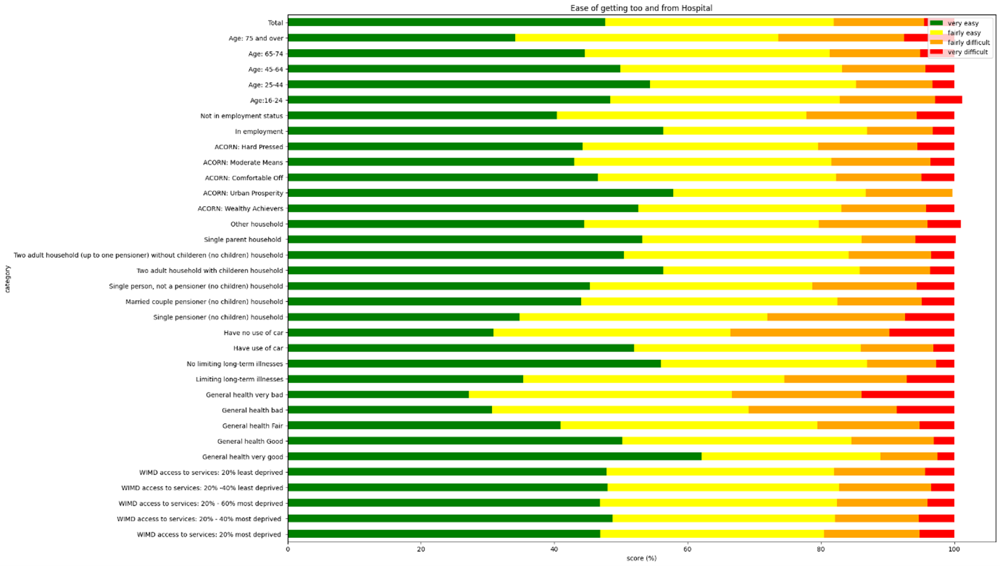
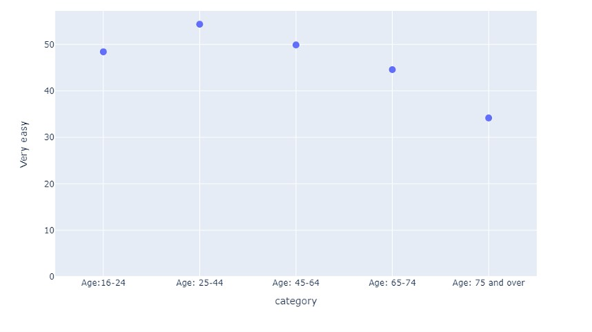
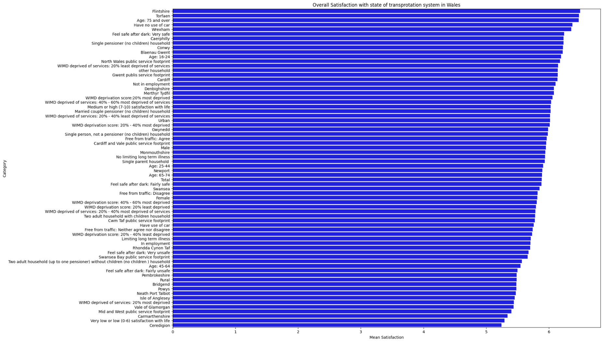
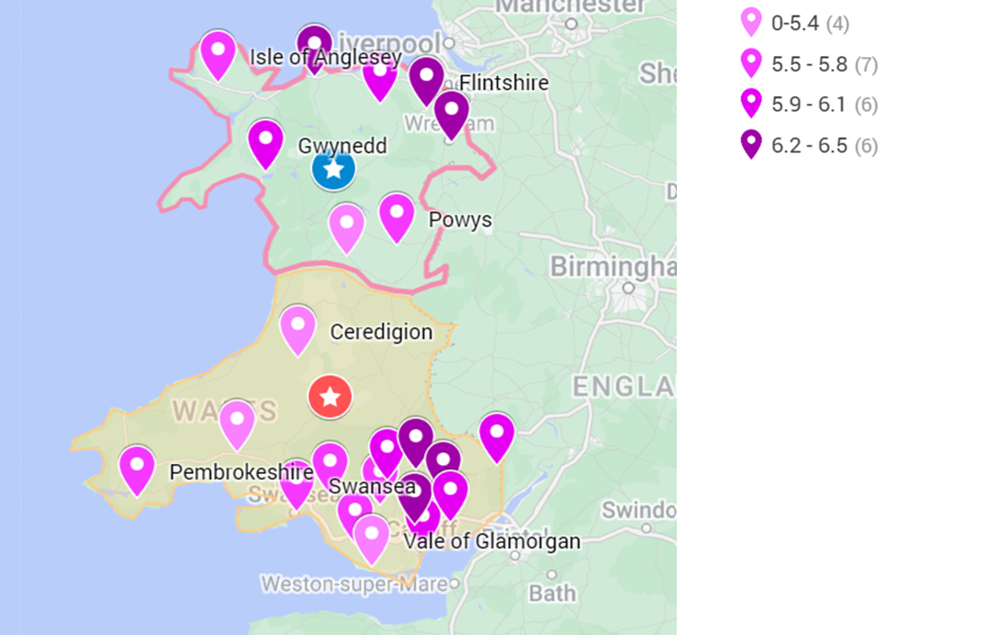
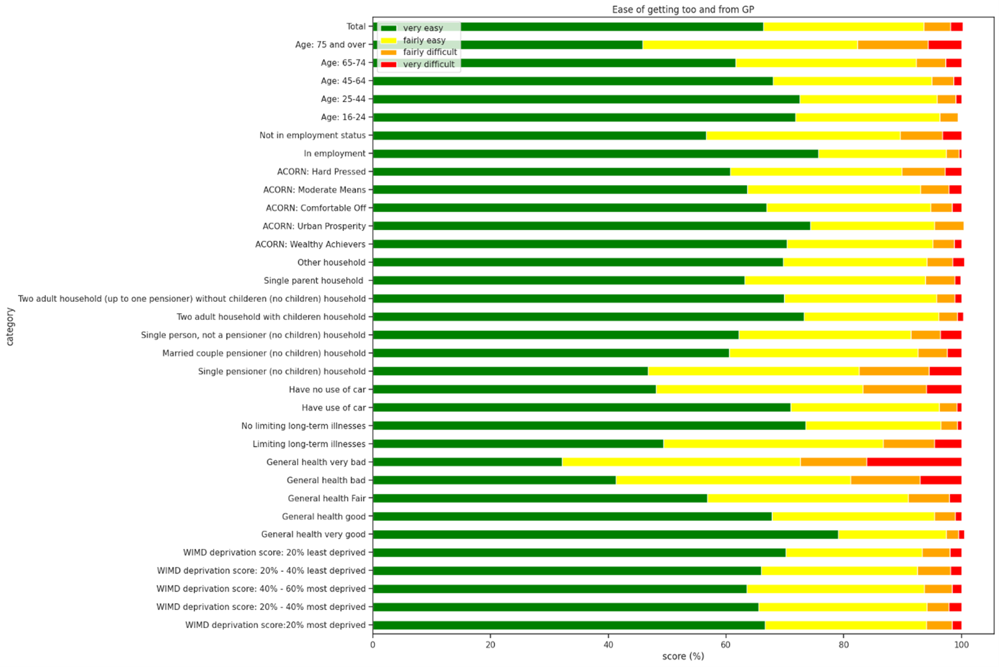

# Analysing User Satisfaction: Public Transport in Wales, UK

## **Introduction**
Wales has developed a comprehensive public transport network shaped by its geography and growing population. 
Challenges with North-South travel have led to higher car ownership and public dissatisfaction. 
The Welsh government has made efforts to improve transport efficiency and public satisfaction. 
This report reviews a 2013-2014 survey to identify key areas for improvement in Wales' transportation system.
 

### **Objective**
Interpretation and visualisation of the dataset to draw relevant conclusions and 
make recommendations which will aid in the improvements of the Welsh transportation system.

[Read more](introduction.md)
---

## **Methodology**
The dataset provided was pre-processed to ensure it was ready for analysis. 
Pre-processing included cleaning the data by addressing missing values and ensuring format consistency, 
integrating datasets, transforming data where necessary, normalising numerical features using 1NF normalisation, 
and reducing the data to eliminate redundancies while maintaining analytical quality.
 

Data analysis was conducted using Google Colab, with Pandas for data manipulation, 
Seaborn for visualisations, and Plotly for interactive charts. 
Although Excel was also used for certain tasks, the tools complemented each other, 
enabling efficient analysis and the creation of visually appealing results. 
Google Colab was chosen over VScode for convenience.

[Read more](methodology.md)
---

## **Results**

The analysis summarizes findings from five datasets, each visualized to enhance understanding:

### ***1. Ease of getting to and from the hospital:*** 
A horizontal stacked bar chart outlines survey responses across four levels ("very easy" to "very difficult"), and a scatter plot highlights public transport accessibility peaking for ages 24-44.
 

    

 

### ***2. Overall satisfaction with Wales' transportation system:*** 
Mean satisfaction scores are presented in a stacked bar chart, supplemented by a Google Maps visualization. Higher satisfaction is observed in the South, with centrally located areas scoring lower.
 

    

 

### ***3. Ease of getting to and from GPs:*** 
Stacked bar charts and a comparative table show GP access as generally easier than hospital access, peaking for ages 25-44, with the lowest scores among those aged 75+.
 

    

 

### ***4. Car usage:*** 
A stacked bar chart compares car usage rates, revealing the lowest levels among individuals in deprived areas or those unemployed.
 

    

 

### ***5. Safety on public transport after dark:*** 
Four stacked bar charts represent perceptions across varying difficulty levels, addressing concerns about night-time safety.
 

    

 

These visualizations effectively communicate trends and disparities across the datasets.
 

[Read more](results.md)
---
## Discussion

[Read more](discussion.md)

---

[References](references.md): Sources and citations used in the project.

[Analysis](insert link): Python scripts used for analysis.

Data: The dataset is stored in the `data/` folder.

### How to Use

1. For more detail on each section click on "read more".
